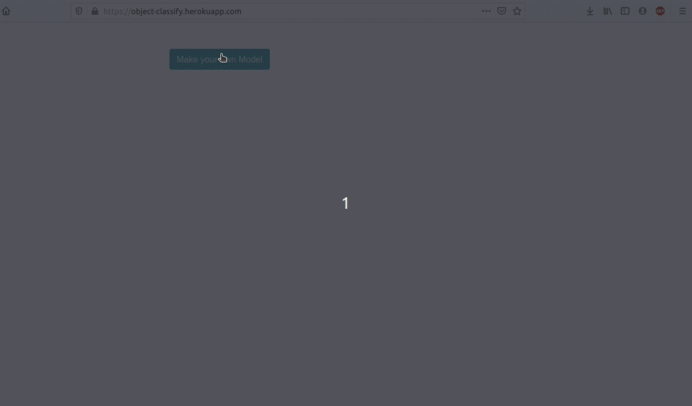

# Model Builder

## caMicroscope Code Challenge for Pathology-development workbench

Hosted app : https://object-classify.herokuapp.com/

Sample Data for training and testing :  [Google Drive Link(~150 MB)](https://drive.google.com/drive/folders/1nWt038sxZei2JCARft2xyGrWwMW4rt8P?usp=sharing)

Demo :



### Steps to use  :
1) Click on ``` Make your own model ```
2) Choose type of training data . At present there are two formats csv and direct images . Sample data of both formats are given in the above link. The image data is 2000 images of cats and dogs(from the kaggle dataset)resized into 64X64X3. The csv is the data of these same images pre-processed and stored in csv format.
3) Click on ``` Load Data ```
4) Now choose the layer parameters . You can add new layers using ``` Add Another Layer ``` button and delete a layer using the ```Delete ``` button.
5) Now click on ``` Compile ``` to compile the choosen layers or click on the ``` Compile Demo Model ``` button to compile a simple demo model .
6) Now enter training parameters.
7) Click on ``` Train Model ``` and wait for training to complete .
8) Upload an image ( size has to be 64X64X3 ; select from the samples for now ) and click on the ``` Predict ``` button.


### Steps to run locally :

#### Requirements :
``` nodejs ``` , ``` express ```

STEPS :

1) Clone the repo
2) ``` cd local-server ```
3) ``` nodejs server.js ```
4) Go to http://localhost:3000/predict.html

Technologies used :

1. Javascript
2. HTML
3. JQuery
4. tfjs
5. BootStrap

Dataset : 

Data taken from  . The images are resized into 64X64X3 . You can use your own images also for training but make sure they are of the size 64X64X3 and the first 3 letters of the name of the image is either 'cat' or 'dog' .( for labels )
